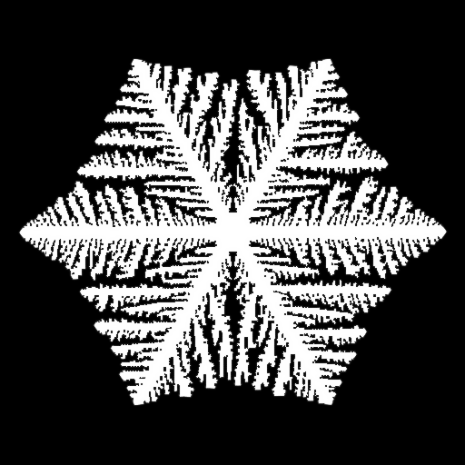

# Snow-Dendrite simulation

**Coupling phase field (PF) and temperature field to simulation the snow growth.** Fast **parallel computing** of partial differential equation (PDE) by **taichi**. 

## Basic ideas

Coupling between **phase field** and **temperature field**, where

+ phase field solves spatial distribution of solid (snow) and liquid
  + anisotropic interface energy
  + temperature-dependent chemical-potential
+ temperature field
  + heat conduction
  + latent heat from solidification

For more information,  see this reference paper: [Kobayashi, R. (1993), "Modeling and numerical simulations of dendritic crystal growth." Physica D 63(3-4): 410-423](https://sci-hub.se/10.1016/0167-2789(93)90120-P). 

The coupled-model and its variables are the same with this paper, with modification by state-of-the-art **gpu-parallel computing** by [**taichi**](https://docs.taichi-lang.org/). Thus, this project here provides a **much faster** computation of the coupling PF model, and mush faster **real-time rendering**. 

## Installation

+ Python and numpy (or Anaconda is better, which includes Python-interpreter and numpy).
+ [**taichi**](https://docs.taichi-lang.org/)

+ get the entire folder of this Snow-Dendrite project. 

## Quick start

For ordinary version, type these in the command line:

`python dendrite.py`

Another version use [hierarchical  data-structure](https://docs.taichi-lang.org/lang/articles/layout) to improve memory-locality memory-IO-efficiency. Usually, we read the left-, right-, up- and down-side neighbors of a node to compute spatial gradient, thus grouping these neighbors together in a block can improve memory efficiency (if infos of this node are loaded from memory to GPU, it's highly possible that infos of its neighbor-nodes are also loaded together to the GPU, hence improving memory and IO  efficiency).

`python dendrite_hierachical.py`

Another version use [SNodes data-structure](https://docs.taichi-lang.org/lang/articles/sparse) which aims to only allocate memory and compute at the interface where changes happen. Since the phase field is spatially sparse and we are only interested in the interface region, thus if we only allocate memory and compute at interface region would save memory and time. The  [SNodes data-structure](https://docs.taichi-lang.org/lang/articles/sparse)  allocates a node when this node is written. 

`python dendrite_snodes.py`

Another version use autodiff to compute complicated derivative of the energy function, which is still under developing since it can not get the correct result. The 2nd-order-gradient term (divergence of gradient's function) is very unstable if we don't expand the expression and compute the 2nd-order-gradient directly. Hierarchically computing the gradient's function first, and following by divergence computing is numerically unstable, unless we get a better method to compute the spatial gradient in the future. 

`python dendrite_autodiff.py`
